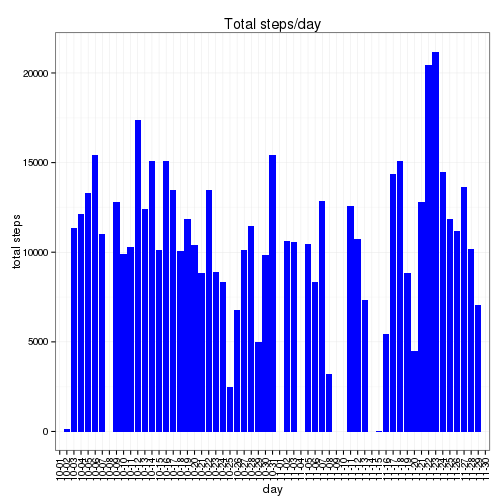

Reproducible Research: Peer Assessment 1
========================================

### Loading and preprocessing the data
Loading the data from the activity.zip file:

```r
setwd("~/workspace/RepData_PeerAssessment1/")
activity_file <- unz("activity.zip", "activity.csv")
activity <- read.csv(activity_file)
```
Transforming the 'date' and 'interval' columns into a date and time POSIXlt format, named 'datetime':

```r
activity$hour <- as.character(activity$interval)
activity$hour <- sapply(activity$hour, function(x) {
    if (nchar(x) == 1) {
        paste0("000", x)
    } else if (nchar(x) == 2) {
        paste0("00", x)
    } else if (nchar(x) == 3) {
        paste0("0", x)
    } else {
        x
    }
})
activity$datetime <- paste(activity$date, activity$hour)
activity$datetime <- strptime(activity$datetime, "%Y-%m-%d %H%M", tz="UTC")
```
Extracting the data farame that is needed for the analysis, named 'data':

```r
data <- activity[, c("steps", "date", "interval", "datetime")]
```

### What is mean total number of steps taken per day?
The histogram of the total number of steps taken each day:

```r
library(ggplot2)
total_steps <- aggregate(data$steps, by=list(data$date), FUN=sum)
names(total_steps) <- c("day", "steps")
ggplot(total_steps, aes(x=day, y=steps)) +
    geom_bar(stat="identity", fill="blue") +
    theme_bw() +
    theme(axis.text.x = element_text(angle=90, hjust=1, vjust=0.5)) +
    scale_x_discrete(labels=substring(total_steps$day, 6)) +
    xlab("day") +
    ylab("total steps") +
    ggtitle("Total steps/day")
```

```
## Warning: Removed 8 rows containing missing values (position_stack).
```

 

The code to calculate the mean and median total number of steps taken per day:

```r
mean_steps_per_day <- mean(total_steps$steps, na.rm=TRUE)
median_steps_per_day <- median(total_steps$steps, na.rm=TRUE)
```
and the values are:
- mean toatal number of steps is 10766
- median toatal number of steps is 10765

### What is the average daily activity pattern?
Time series plot of the 5-minute interval (x-axis) and the average number of steps taken, averaged across all days (y-axis)


```r
data <- data[complete.cases(data$steps),]
minute_steps <- aggregate(data$steps, by=list(data$interval), FUN=mean)
names(minute_steps) <- c("interval", "steps")
max_steps <- minute_steps[minute_steps$steps == max(minute_steps$steps), "interval"]
ggplot(minute_steps, aes(x=interval, y=steps)) +
    geom_line() +
    geom_vline(xintercept = max_steps, colour="green", linetype = "longdash") +
    scale_x_continuous(breaks=c(0, 500, 1000, 1500, 2000, max_steps)) +
    theme_bw() +
    ggtitle("Mean steps/interval")
```

 

Which 5-minute interval, on average across all the days in the dataset, contains the maximum number of steps?  
The maximum number of steps 5-minute interval is 835

### Imputing missing values


### Are there differences in activity patterns between weekdays and weekends?
