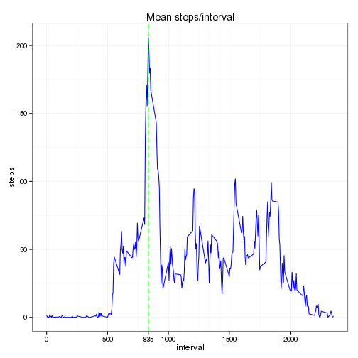

Reproducible Research: Peer Assessment 1
========================================

### Loading and preprocessing the data
Loading the data from the activity.zip file:

```r
setwd("~/workspace/RepData_PeerAssessment1/")
activity_file <- unz("activity.zip", "activity.csv")
activity <- read.csv(activity_file)
```
Transforming the 'date' and 'interval' columns into a date and time POSIXlt format, named 'datetime':

```r
activity$hour <- as.character(activity$interval)
activity$hour <- sapply(activity$hour, function(x) {
    if (nchar(x) == 1) {
        paste0("000", x)
    } else if (nchar(x) == 2) {
        paste0("00", x)
    } else if (nchar(x) == 3) {
        paste0("0", x)
    } else {
        x
    }
})
activity$datetime <- paste(activity$date, activity$hour)
activity$datetime <- strptime(activity$datetime, "%Y-%m-%d %H%M", tz="UTC")
```
Extracting the data farame that is needed for the analysis, named 'data':

```r
data <- activity[, c("steps", "date", "interval", "datetime")]
```

### What is mean total number of steps taken per day?
The histogram of the total number of steps taken each day:

```r
library(ggplot2)
total_steps <- aggregate(data$steps, by=list(data$date), FUN=sum)
names(total_steps) <- c("day", "steps")
ggplot(total_steps, aes(x=day, y=steps)) +
    geom_bar(stat="identity", fill="blue") +
    theme_bw() +
    theme(axis.text.x = element_text(angle=90, hjust=1, vjust=0.5)) +
    scale_x_discrete(labels=substring(total_steps$day, 6)) +
    xlab("day") +
    ylab("total steps") +
    ggtitle("Total steps/day")
```

```
## Warning: Removed 8 rows containing missing values (position_stack).
```

 

The code to calculate the mean and median total number of steps taken per day:

```r
mean_steps_per_day <- mean(total_steps$steps, na.rm=TRUE)
median_steps_per_day <- median(total_steps$steps, na.rm=TRUE)
```
and the values are:
- mean toatal number of steps is 10766
- median toatal number of steps is 10765

### What is the average daily activity pattern?
Time series plot of the 5-minute interval (x-axis) and the average number of steps taken, averaged across all days (y-axis)


```r
data_nona <- data[complete.cases(data$steps),]
minute_steps <- aggregate(data_nona$steps, by=list(data_nona$interval), FUN=mean)
names(minute_steps) <- c("interval", "steps")
max_steps <- minute_steps[minute_steps$steps == max(minute_steps$steps), "interval"]
ggplot(minute_steps, aes(x=interval, y=steps)) +
    geom_line() +
    geom_vline(xintercept = max_steps, colour="green", linetype = "longdash") +
    scale_x_continuous(breaks=c(0, 500, 1000, 1500, 2000, max_steps)) +
    theme_bw() +
    ggtitle("Mean steps/interval")
```

 

Which 5-minute interval, on average across all the days in the dataset, contains the maximum number of steps?  
The maximum number of steps 5-minute interval is 835

### Imputing missing values
The total number of rows with missing values in the dataset is 2304 out of 17568 total rows.  
Create a new dataset that is equal to the original dataset but with the missing data filled in. The strategy for filling in the NA's is that for every interval with NA steps to fill it with the mean for that interval.

```r
newdata <- data
for (i in c(1:nrow(newdata))) {
    if (is.na(newdata[i, "steps"])) {
        newdata[i, "steps"] <- minute_steps[minute_steps$interval == newdata[i, "interval"], "steps"]
    }
}
```
The histogram of the total number of steps taken each day for the new data set, with the missing values filled:

```r
total_steps_2 <- aggregate(newdata$steps, by=list(newdata$date), FUN=sum)
names(total_steps_2) <- c("day", "steps")
ggplot(total_steps_2, aes(x=day, y=steps)) +
    geom_bar(stat="identity", fill="blue") +
    theme_bw() +
    theme(axis.text.x = element_text(angle=90, hjust=1, vjust=0.5)) +
    scale_x_discrete(labels=substring(total_steps_2$day, 6)) +
    xlab("day") +
    ylab("total steps") +
    ggtitle("Total steps/day")
```

 

The code to calculate the mean and median total number of steps taken per day for the new data set:

```r
mean_steps_per_day_2 <- mean(total_steps_2$steps, na.rm=TRUE)
median_steps_per_day_2 <- median(total_steps_2$steps, na.rm=TRUE)
```
and the values are:
- mean toatal number of steps is 10766
- median toatal number of steps is 10766  

The old values of the mean and median total number of steps taken per day for the data set with missing values are: 
- mean toatal number of steps is 10766
- median toatal number of steps is 10765  

So, basically there is no change. The explanation is the following:
- the mean and median were calculated ignoring the missing values (NA's)
- the strategy used to fill the NA's was to use the mean for every interval and doing so the total mean didn't change. You can see that the total median is changed by 1 as a result of this strategy.

### Are there differences in activity patterns between weekdays and weekends?
